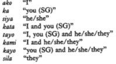
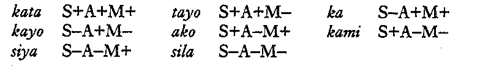

---
...

Agar p. 72-88 & Foley p. 106-114, 125-126
=========================================

22 September
------------

If the Principle of Linguistic Relativity is taken as a theoretical
baseline in the study of languacultures, the question becomes “Given
that languacultures are different to the point of incommensurability,
from what common perspective, or by using what uniform analytical
framework, may they be analyzed, described, and compared?” As discussed
in the readings from Agar and Foley, cognitive anthropology is one
attempt to provide such a common analytical framework for linguistic
anthropology.

Agar characterizes cognitive anthropology as a way of using human
similarities to explore and explain cultural differences, where cultures
are conceived, as the anthropologist Tyler put it (Foley, p. 107), as
“cognitive organizations of material phenomena”. The types of ‘human
similarities’ which cognitive anthropology explores are shared
structural properties of languages: (i) taxonomic relationships between
words, (ii) componential (or ‘structural semantic’) relationships
between words; (iii) case relations between verbs and other sentence
components, and (iv) part-whole relationships. Charting these structural
properties in a language’s vocabulary is held to reveal the culturally
distinctive cognitive categories, classifications, and conceptual
connections—i.e., the “habitual forms of thought”—by means of which its
speakers culturally construe the world.

1.  Explain the pronoun system of Tagalog as summarized by Foley in the
    table midway down on p.111.\
    \
    

2.  What does Foley say is the purpose of this type of contrast-based
    componential (or “structural semantic”) analysis? What is it
    intended to reveal? Why, on p.112, does Foley suggest “a more modest
    goal for cognitive anthropologists”?

3.  Similar to Foley’s discussion of Hanunoo plant taxonomy
    (pp. 113-114), Agar provides an illustrative taxonomy of terms for
    vehicles (car, bicycles, etc.). Come to class prepared to explain a
    linguistic example of such a hierarchical taxonomic system, one with
    which you are familiar. One example would be (student)
    drinking terms. (But now that I’ve suggested it, you might come
    across as a bit of a slacker if you didn’t come up with some other
    example of your own….) Terms for all the kinds of affectionate
    relationships between people? Terms for types of music, or beers?
    Terms for political positions? The greater the complexity of the
    system the better. It doesn’t matter whether the system is specific
    to W&M, to ‘American culture’, or to another culture you’re have
    some familiarity with. . Perhaps it’s a linguistic system of this
    kind that you’ve been intrigued by in “another culture”?

4.  Agar comes up with a different sort of analtyical framework for
    formalizing the cognitive organization of the situation of ‘getting
    off’, as heroin addicts discuss it in his ethnographic data. Explain
    the componets of his analysis and provide an analogous example of a
    situation familiar to you.

5.  Please also prepare a linguistic example of a partonomy
    (Foley, pp. 125-126).
